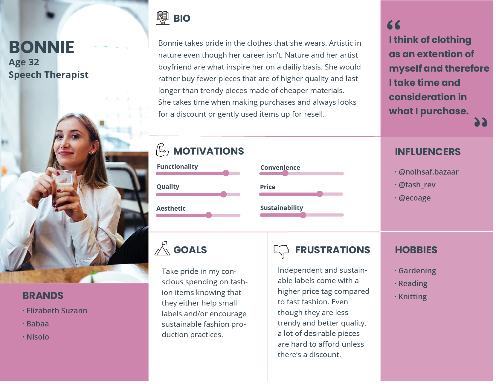
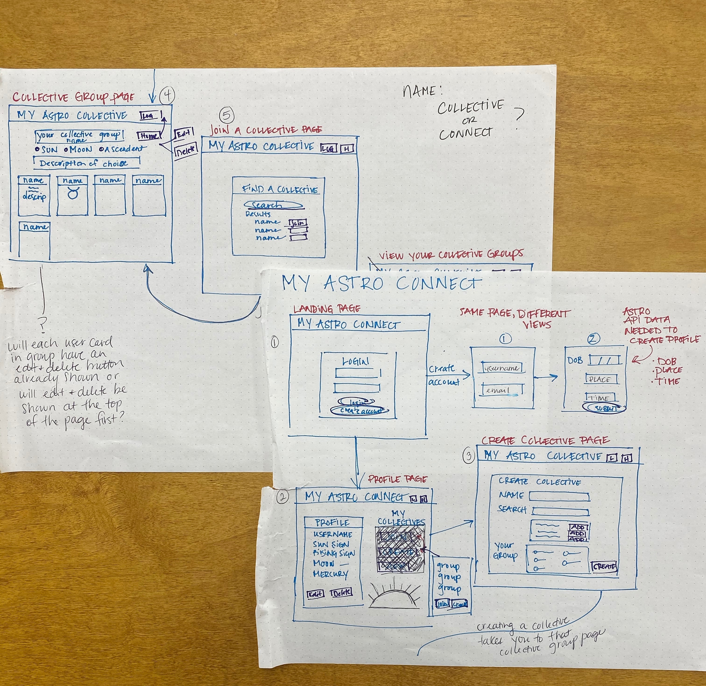
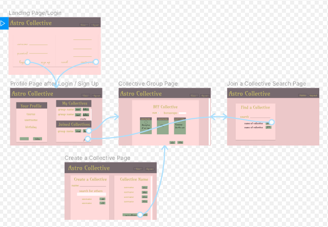

This project was bootstrapped with [Create React App](https://github.com/facebook/create-react-app).

## Astro Collective

By Summer Liddington

## Brief Proposal
An app that lets the user create a profile of their personal astrology chart and then be able to either create or join a group (aka collective). The user can then to see how their astrology profile relates to other users within that group that they join and add users to a group that they create.

Reasoning behind this idea: When groups of people come together for a reason it’s always intriguing to see the personality similarities and differences between one another. Much like the other personality tests out there, astrology can be used as another way to understand other's underlying characteristics without taking them to therapy.

## Challenge Statement
How might we create an application that allows atrology enthusiasts compare natal charts of more than 2 people?

## Personas

## Wireframes

## Mockups via Figma

## ERD
https://dbdiagram.io/d/5da8a99502e6e93440f2579d

## To View:
### `npm start`
How to Run this App
Follow these steps exactly
1. clone this repository.
2. cd into the directory it creates.
3. Make a database.json file in the api directory.
4. Run npm install and wait for all dependencies to be installed.
5. Run npm start to verify that installation was successful

Runs the app in the development mode. 
Open [http://localhost:3000](http://localhost:3000) to view it in the browser.

The page will reload if you make edits. 
You will also see any lint errors in the console.

